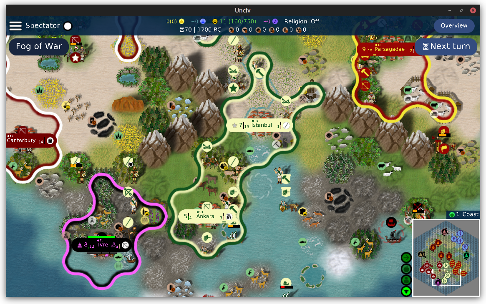
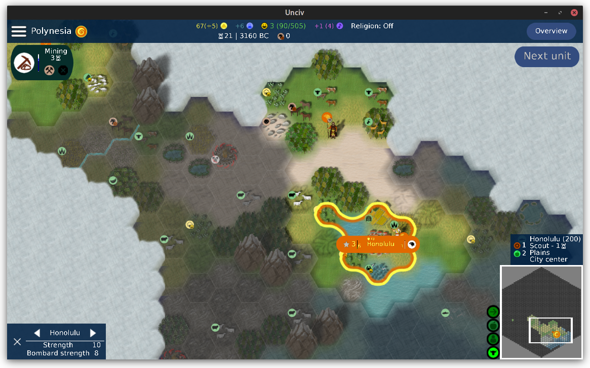

This is an **experimental** fork of @ravignir's 5Hex tileset.

This adds:
- Terrain blending.
- Unit and terrain feature shadows.
- An automatic build system for adding such features onto the existing tileset images.

All the tile and unit art is by @ravignir!

See:
- https://github.com/ravignir/5Hex-Tileset for the 5Hex tileset.
- https://github.com/yairm210/Unciv/pull/5874 for game code support.
- https://github.com/will-ca/Bubbly-Borders-Example if you just want the smooth borders.
